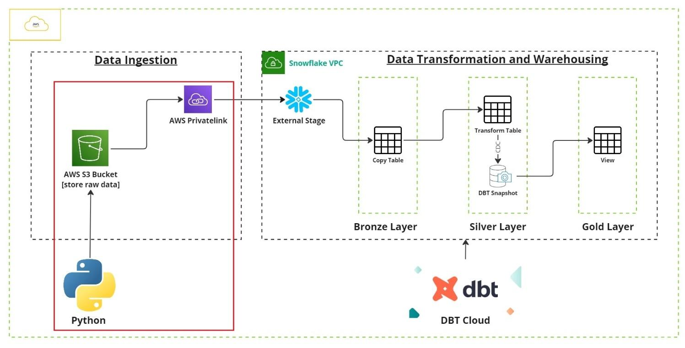
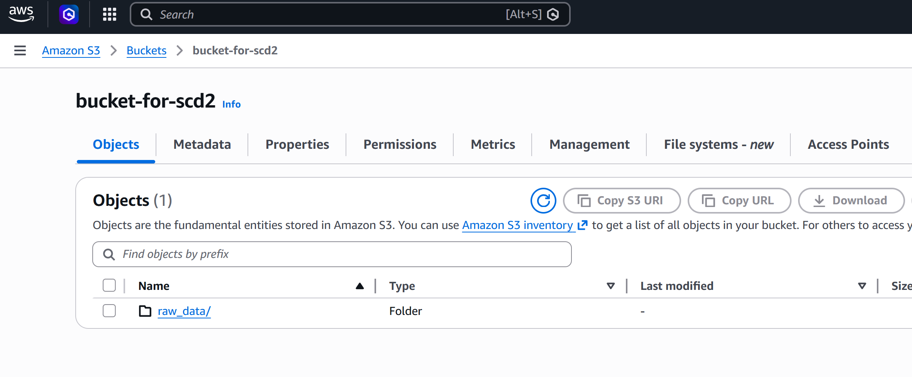
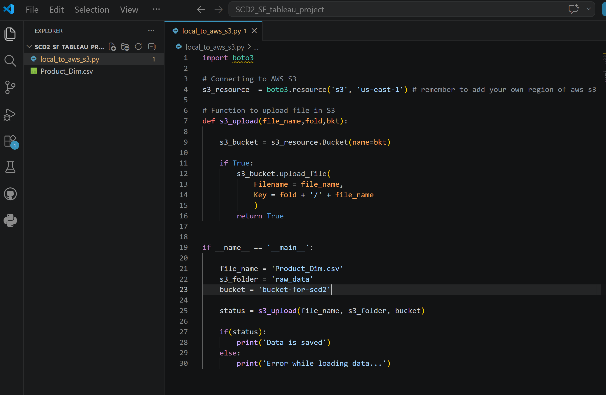
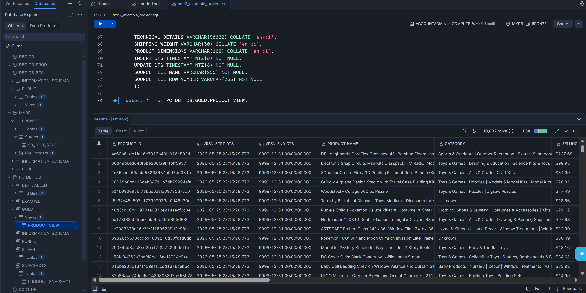
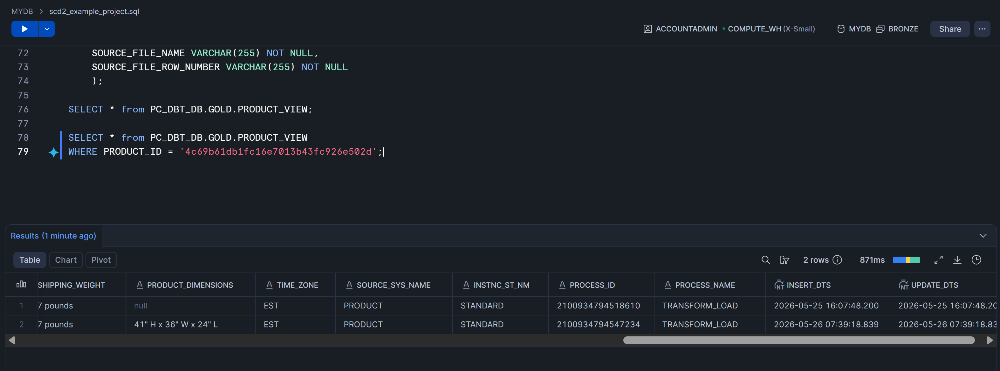
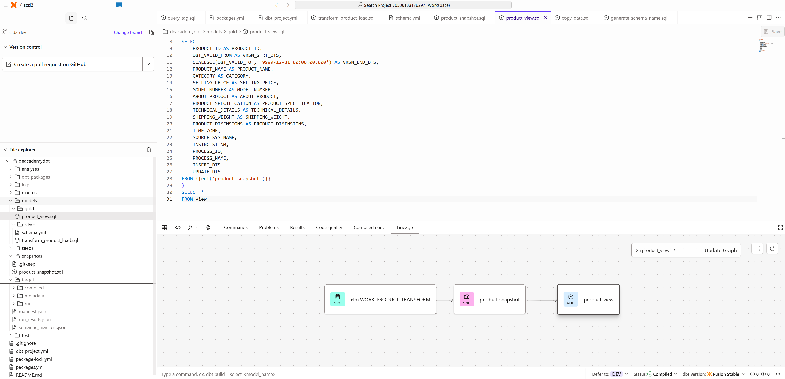
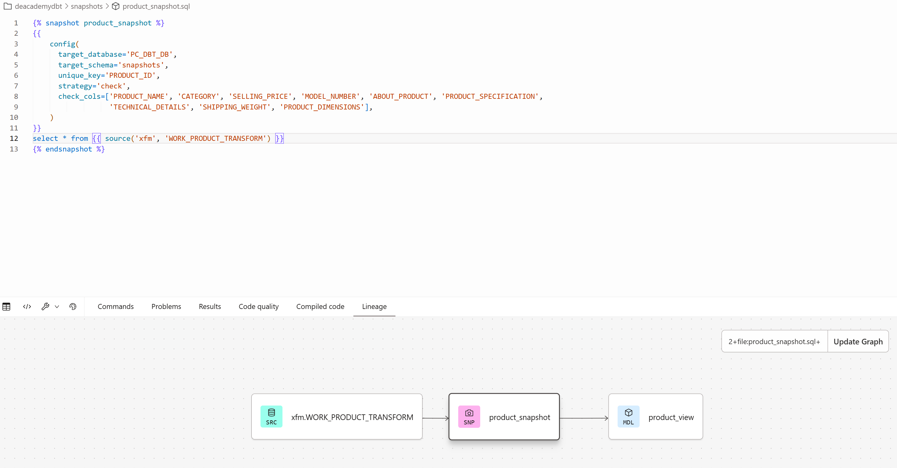
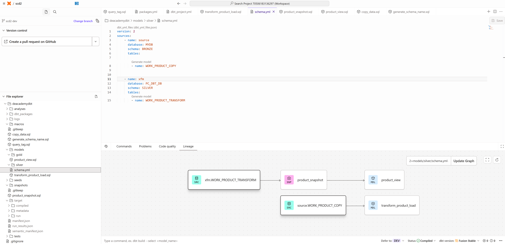
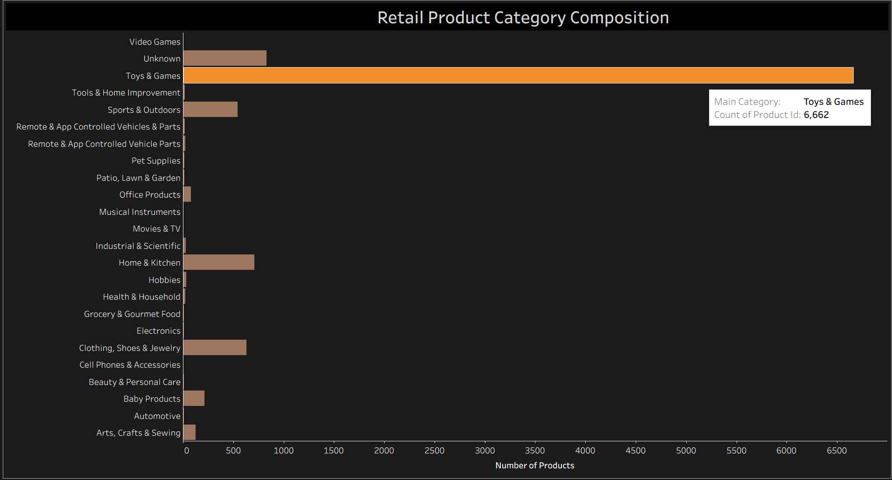

# Snowflake dbt SCD2 Pipeline

End-to-end cloud data engineering pipeline implementing Slowly Changing Dimension Type 2 (SCD2) architecture using AWS S3, Snowflake, dbt snapshots, and Python automation.

---

# End-to-End Architecture

# Project Overview

This project demonstrates a production-style modern data pipeline that:

- Uploads source data into AWS S3 using Python automation
- Loads raw data into Snowflake Bronze layer
- Transforms data through dbt models
- Tracks historical record changes using dbt snapshots (SCD Type 2)
- Creates analytical Gold-layer views for downstream reporting and BI usage

The pipeline simulates a real-world dimensional modeling workflow commonly used in analytics engineering and cloud data platforms.

---

# Architecture

AWS S3 → Snowflake Bronze → dbt Transform Layer → dbt Snapshot (SCD2) → Gold Analytical View

---

# Tech Stack

- Snowflake
- dbt Cloud
- AWS S3
- Python
- SQL
- Dimensional Modeling
- SCD Type 2
- Data Warehousing
- Cloud Data Engineering
- Tableau
- Business Intelligence Visualization

---

# Key Features

## SCD Type 2 Version Tracking
Tracks historical changes to dimensional attributes while preserving prior versions of records.

## dbt Snapshot Logic
Implements dbt snapshot strategy using unique keys and change detection columns.

## Layered Data Architecture
Follows Bronze → Silver → Gold warehouse design pattern.

## Automated Cloud File Upload
Python automation uploads source files into AWS S3 bucket storage.

## Gold Reporting Layer
Creates business-facing analytical views for downstream consumption.

---

## Tableau Dashboard Integration

Connects Snowflake Gold-layer analytical views to Tableau for downstream reporting and visualization.

---

# Pipeline Screenshots

## AWS S3 Bucket

## Python S3 Upload Automation

## Snowflake Gold Layer View

## SCD2 Version Tracking

## dbt Snapshot Logic

## dbt Lineage Architecture

## dbt Transformation Model

## Tableau Dashboard Visualization

---

# Skills Demonstrated

- Cloud Data Engineering
- Analytics Engineering
- Data Warehousing
- Snowflake Development
- dbt Modeling
- SCD2 Historical Tracking
- Python Automation
- AWS S3 Integration
- SQL Transformation Pipelines
- Data Lineage Design
- Bronze/Silver/Gold Architecture

---

# Business Use Case

This architecture is commonly used in enterprise analytics environments where businesses need:

- Historical tracking of dimensional data
- Auditable record versioning
- Reliable transformation pipelines
- Cloud-native warehouse architectures
- Scalable analytical reporting layers

---

# Future Improvements

- Add orchestration with Airflow
- Add CI/CD deployment workflow
- Add automated dbt testing
- Expand Tableau reporting layer with additional business KPIs
- Add Snowflake task scheduling
- Add monitoring and alerting
